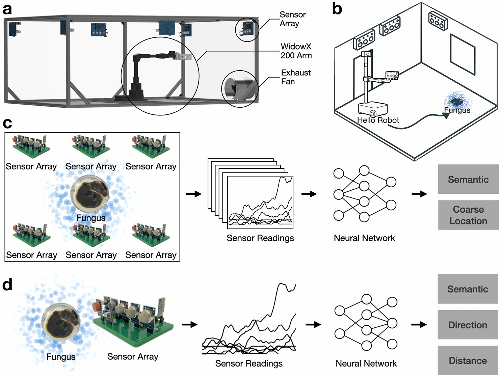

# Scensory: Automated Real-Time Fungal Identification and Spatial Mapping
[Yanbaihui Liu](https://yanbhliu.github.io/), Erica Babusci, Claudia K. Gunsch, [Boyuan Chen](http://boyuanchen.com/)
<br>
Duke University
<br>

[website](http://generalroboticslab.com/Scensory) | [paper]()

<p align="center">
     
</p>


## Overview
Indoor fungal contamination poses significant risks to public health, yet existing detection methods are slow, costly, and lack spatial resolution. Conventional approaches rely on laboratory analysis or high-concentration sampling, making them unsuitable for real-time monitoring and scalable deployment. We introduce Scensory, a robot-enabled olfactory system that simultaneously identifies fungal species and localizes their spatial origin using affordable volatile organic compound (VOC) sensor arrays and deep learning. Our key idea is that temporal VOC dynamics encode both chemical and spatial signatures, which we decode through neural architectures trained on robot-automated data collection. We demonstrate two operational modes: a passive multi-array configuration for environmental monitoring, and a mobile single-array configuration for active source tracking. Across five fungal species, our system achieves up to 89.85\% accuracy in species detection and 87.31\% accuracy in localization under ambient conditions, where each prediction only takes 3--7s sensor inputs. Additionally, by computationally analyzing model behavior, we can uncover key biochemical signatures without additional laboratory experiments. Our approach enables real-time, spatially aware fungal monitoring and establishes a scalable and affordable framework for autonomous environmental sensing.


## Prerequisites

1. Clone the repository:

    ```bash
    git clone https://github.com/generalroboticslab/Scensory.git
    ```

2. Create and activate a new virtual environment:

    ```bash
    virtualenv new_env_name
    source new_env_name/bin/activate
    ```

3. Install the required dependencies:

    ```bash
    pip install -r requirements.txt
    ```

## Dataset


Our dataset is available [here](https://github.com/generalroboticslab/Scensory/tree/main/dataset).

## Training

```bash
# Multi-array
python training/main_task1_cls.py    # species classification
python training/main_task1_loc.py    # localization

# Single-array
python training/main_task2_cls.py    # species classification
python training/main_task2_dir.py    # direction
python training/main_task2_dist.py   # distance
```

## Evaluation

```bash
# Multi-array
python evaluation/evaluate_task1_cls.py    # species classification
python evaluation/evaluate_task1_loc.py    # localization

# Single-array
python evaluation/evaluate_task2_cls.py    # species classification
python evaluation/evaluate_task2_dir.py    # direction
python evaluation/evaluate_task2_dist.py   # distance
```

## Pretrained Weights

We provide pretrained model weights in the [pretrained](https://github.com/generalroboticslab/Scensory/tree/main/pretrained) folder for quick evaluation and testing. These models are ready to use without additional training.

## Citation

If you think this paper is helpful, please consider cite our work

```plaintext

```

## License
This repository is released under the CC BY-NC-ND 4.0 License. Duke University has filed patent rights for the technology associated with this article. For further license rights, including using the patent rights for commercial purposes, please contact Duke's Office for Translation and Commercialization ([otcquestions@duke.edu](mailto:otcquestions@duke.edu)) and reference OTC DU8859PROV. See [LICENSE](https://github.com/generalroboticslab/Scensory/blob/main/LICENSE-CC-BY-NC-ND-4.0.md) for additional details.
